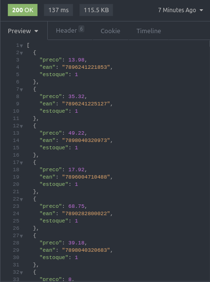
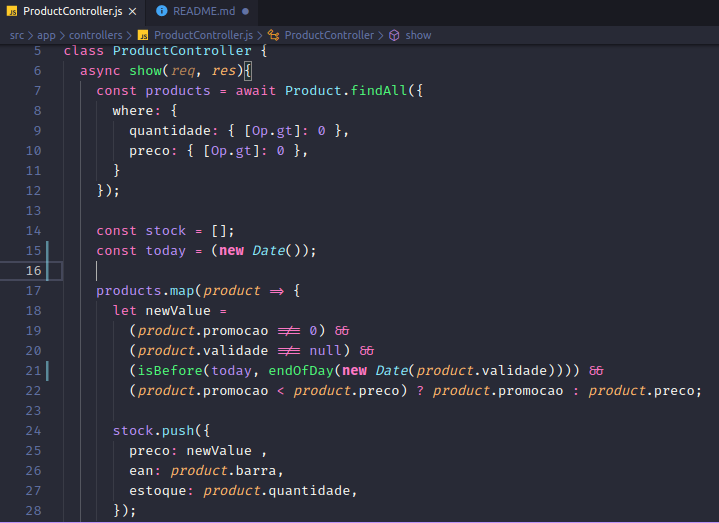

<h1 align="center">
  
</h1>

<h3 align="center">
  PediuFarma: desafio!
</h3>

<p align="center">
  
  
  
   
  
  <a href="https://github.com/mlg404/pediuFarma-desafio/commits/master">
    
  </a>
  
  <a href="https://github.com/mlg404/pediuFarma-desafio/issues">
    
  </a>

  <a href="https://github.com/mlg404/pediuFarma-desafio/blob/master/LICENSE">
     
  </a>
</p>

<p>Este é um desafio realizado pela PediuFarma, designado à oportunidade que eles estão oferecendo.</p>

<p align="center">
  <a href="#rocket-info">Info</a>&nbsp;&nbsp;&nbsp;|&nbsp;&nbsp;&nbsp;
  <a href="#computer-tecnologias">Tecnologias</a>&nbsp;&nbsp;&nbsp;|&nbsp;&nbsp;&nbsp;
  <a href="#information_source-como">Como</a>&nbsp;&nbsp;&nbsp;|&nbsp;&nbsp;&nbsp;
  <a href="#busts_in_silhouette-contribua">Contribua</a>&nbsp;&nbsp;&nbsp;|&nbsp;&nbsp;&nbsp;
  <a href="#memo-licence">Licença</a>
</p>

<p align="center" style="display: flex; align-items: center; justify-content:center;">
  
  
</p>

## :rocket: Info

Na primeira etapa, o desafio consistia em fazer engenharia reversa no banco de dados deles e retirar informações para as próximas etapas!
Na segunda etapa, tivemos que montar um JSON com o preço, código de barras e quantidade dos produtos em estoque, porém tinha uma regra: se o produto tivesse um preço promocional, o mesmo deveria ser exibido com este preço promocional, caso tivesse dentro da validade da promoção.

[Gravei um vídeo fazendo a instalação e alguns comentários por cima, basta clicar aqui!](https://www.youtube.com/watch?v=c-WqA4IOsNE)

## :computer: Tecnologias

Este projeto foi desenvolvido com as seguintes tecnologias:

- [NodeJS][nodejs]
- [Date-fns](https://date-fns.org/)
- [Sucrase](https://sucrase.io/)
- [Nodemon](https://nodemon.io/)
- [Express](https://expressjs.com/pt-br/)
- [Sequelize](https://sequelize.org/)
- [Docker](https://www.docker.com/)
- [VS Code][vc] 


## :information_source: Como

Para clonar e rodar esta aplicação, você precisará de [Git](https://git-scm.com) + [Yarn v1.22.4][yarn] ou superior (exceto versão 2 ou superior) + [NodeJS][nodejs] instalados em seu computador.
Rode num terminal:

```bash
# Clone este repositório
$ git clone https://github.com/mlg404/pediuFarma-desafio.git pediuFarma-desafio

# Acesse-o
$ cd pediuFarma-desafio

# Instale as dependencias
$ yarn install

# Rode a aplicação
$ yarn dev
```
**Importante**: Você precisará ter um servidor mysql rodando em sua máquina. Eu escolhi criar um container no Docker e subir o mysql. Lembre-se de configurar as informações no arquivo `~/config/database.js`

**Vendo o resultado**: o resultado pode ser visto acessando `http://localhost:3333/` ou algum aplicativo que faça requisições http (gosto de utilizar o Insomnia)

## :busts_in_silhouette: Contribua

- Fork neste repositório;
- Crie uma branch com sua feature: `git checkout -b my-feature`;
- Faça um Commit suas alterações: `git commit -m 'feat: My new feature'`;
- Dê Push na sua branch: `git push origin my-feature`.

Abra um pull request com sua branch. Após sua pull request receber um merge, você deve deletar sua branch.

## :memo: Licença
This project is under MIT license. See [LICENSE](https://github.com/mlg404/pediuFarma-desafio/blob/master/LICENSE) for more information.

---

Made with 💙 by Victor Eyer :wave: [Get in touch!](https://www.linkedin.com/in/victoreyer/)

[nodejs]: https://nodejs.org/
[vc]: https://code.visualstudio.com/
[yarn]: https://classic.yarnpkg.com/lang/en/
